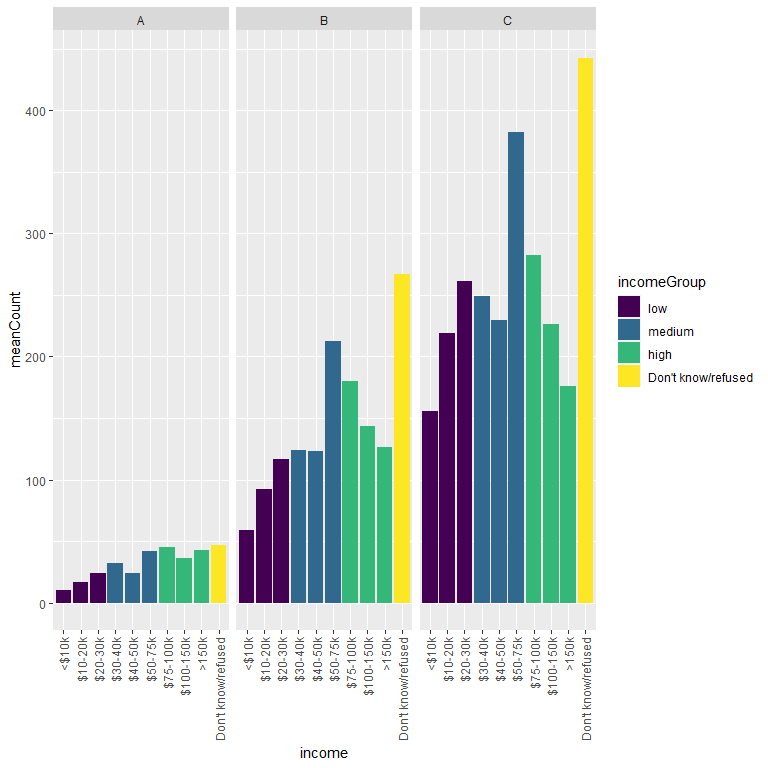

#### Background:

Pivoting data can be a pain point in bioinformatics workflows. Lots of
bioinformatics software are tied to the **wide** format with data spread
out among multiple columns while the whole tidyverse/ggplot system
requires **long** data with as few columns as possible. Becoming
proficient at switching your data to **long** format has several
benefits. (1) It provides a unified format for any required data
manipulations and summarizations making them faster to write and easier
to read and (2) it is the required input format for the ggplot system.
In R [the tidyverse](https://www.tidyverse.org/) provides the tools to
interchange **wide** and **long** data.

#### The Problem:

Typically subjects in bioinformatics datasets (columns) will have
associated metadata like treatments and indicators of groups or
replicates. Any metadata that corresponds to rows can be easily added to
the data.frame to be pivoted (eg. with `cbind`). But if there are column
metadata they have to be added manually after the pivot.

#### The Solution:

There are a couple of ways to do this. The way I’ve settled on is to
have a table of target meta-data and use a join after the pivot to
connect it to the data. I find myself doing this repeatedly in almost
all of my analyses but it’s a solution I stumbled on by trial and error.
I have never seen it spelled out explicitly anywhere so here it is.

    head(relig_income)

    ## # A tibble: 6 x 11
    ##   religion `<$10k` `$10-20k` `$20-30k` `$30-40k` `$40-50k` `$50-75k` `$75-100k`
    ##   <chr>      <dbl>     <dbl>     <dbl>     <dbl>     <dbl>     <dbl>      <dbl>
    ## 1 Agnostic      27        34        60        81        76       137        122
    ## 2 Atheist       12        27        37        52        35        70         73
    ## 3 Buddhist      27        21        30        34        33        58         62
    ## 4 Catholic     418       617       732       670       638      1116        949
    ## 5 Don’t k~      15        14        15        11        10        35         21
    ## 6 Evangel~     575       869      1064       982       881      1486        949
    ## # ... with 3 more variables: `$100-150k` <dbl>, `>150k` <dbl>, `Don't
    ## #   know/refused` <dbl>

#### First, create the metadata.

I’ll use the `relig_income` dataset as an example. I will demonstrate
how to add both row metadata (easy) and column metadata (bit tricky).
For row metadata I will add a new column for religion class that will be
defined randomly and for column metadata I will group income levels into
low, medium, high and unknown listed in a separate `data.frame`. Note
that this method relies on linking data column names to metadata so
check the metadata table carefully!

To add the row metadata I simply add a new column to the `relig_income`
table with my random values. For the column metadata I will make a new
`data.frame`.

    ## Row metadata
    set.seed(10)
    relig_income$religionClass <- 
      sample(c("A", "B", "C"), nrow(relig_income), replace = TRUE)

    ## Column metadata
    columnMetadata <- data.frame(
      income = c(colnames(relig_income)[
        grepl("0", colnames(relig_income))],
        "Don't know/refused"),
      incomeGroup = c(rep("low", 3), rep("medium", 3), 
                rep("high", 3), "Don't know/refused"))
    columnMetadata

    ##                income        incomeGroup
    ## 1               <$10k                low
    ## 2             $10-20k                low
    ## 3             $20-30k                low
    ## 4             $30-40k             medium
    ## 5             $40-50k             medium
    ## 6             $50-75k             medium
    ## 7            $75-100k               high
    ## 8           $100-150k               high
    ## 9               >150k               high
    ## 10 Don't know/refused Don't know/refused

#### Step 1: pivot\_longer as usual

Don’t forget to exclude the new `religionClass` column from the pivot.

    relig_income %>%
      pivot_longer(-c(religion, religionClass), names_to = "income", values_to = "count")

    ## # A tibble: 180 x 4
    ##    religion religionClass income             count
    ##    <chr>    <chr>         <chr>              <dbl>
    ##  1 Agnostic C             <$10k                 27
    ##  2 Agnostic C             $10-20k               34
    ##  3 Agnostic C             $20-30k               60
    ##  4 Agnostic C             $30-40k               81
    ##  5 Agnostic C             $40-50k               76
    ##  6 Agnostic C             $50-75k              137
    ##  7 Agnostic C             $75-100k             122
    ##  8 Agnostic C             $100-150k            109
    ##  9 Agnostic C             >150k                 84
    ## 10 Agnostic C             Don't know/refused    96
    ## # ... with 170 more rows

#### Step 2: join the column metadata

All metadata columns will be added automatically with this step.

    relig_income %>%
      pivot_longer(-c(religion, religionClass), names_to = "income", values_to = "count") %>%
      inner_join(columnMetadata, by = "income")

    ## # A tibble: 180 x 5
    ##    religion religionClass income             count incomeGroup       
    ##    <chr>    <chr>         <chr>              <dbl> <chr>             
    ##  1 Agnostic C             <$10k                 27 low               
    ##  2 Agnostic C             $10-20k               34 low               
    ##  3 Agnostic C             $20-30k               60 low               
    ##  4 Agnostic C             $30-40k               81 medium            
    ##  5 Agnostic C             $40-50k               76 medium            
    ##  6 Agnostic C             $50-75k              137 medium            
    ##  7 Agnostic C             $75-100k             122 high              
    ##  8 Agnostic C             $100-150k            109 high              
    ##  9 Agnostic C             >150k                 84 high              
    ## 10 Agnostic C             Don't know/refused    96 Don't know/refused
    ## # ... with 170 more rows

#### Step 3 (optional): Convert character data to ordered factors to control plotting order

    relig_income %>%
      pivot_longer(-c(religion, religionClass), names_to = "income", values_to = "count") %>%
      inner_join(columnMetadata, by = "income") %>%
      mutate(income = ordered(income, levels = columnMetadata$income))

    ## # A tibble: 180 x 5
    ##    religion religionClass income             count incomeGroup       
    ##    <chr>    <chr>         <ord>              <dbl> <chr>             
    ##  1 Agnostic C             <$10k                 27 low               
    ##  2 Agnostic C             $10-20k               34 low               
    ##  3 Agnostic C             $20-30k               60 low               
    ##  4 Agnostic C             $30-40k               81 medium            
    ##  5 Agnostic C             $40-50k               76 medium            
    ##  6 Agnostic C             $50-75k              137 medium            
    ##  7 Agnostic C             $75-100k             122 high              
    ##  8 Agnostic C             $100-150k            109 high              
    ##  9 Agnostic C             >150k                 84 high              
    ## 10 Agnostic C             Don't know/refused    96 Don't know/refused
    ## # ... with 170 more rows

Finally look at the mapping to ensure it worked. Unfortunately table
doesn’t play well with the `%>%` operator so this step is a bit
inelegant.

    test <- relig_income %>%
      pivot_longer(-c(religion, religionClass), names_to = "income", values_to = "count") %>%
      inner_join(columnMetadata, by = "income") %>%
      mutate(income = ordered(income, levels = columnMetadata$income))

    table(test$income, test$incomeGroup)

    ##                     
    ##                      Don't know/refused high low medium
    ##   <$10k                               0    0  18      0
    ##   $10-20k                             0    0  18      0
    ##   $20-30k                             0    0  18      0
    ##   $30-40k                             0    0   0     18
    ##   $40-50k                             0    0   0     18
    ##   $50-75k                             0    0   0     18
    ##   $75-100k                            0   18   0      0
    ##   $100-150k                           0   18   0      0
    ##   >150k                               0   18   0      0
    ##   Don't know/refused                 18    0   0      0

#### The metadata columns are now available

We can plot the data summarized by our arbitrary grouping of religions
and colored by our grouped income levels. Order the income classes to
make a sensible presentation

    relig_income %>%
      pivot_longer(-c(religion, religionClass), names_to = "income", values_to = "count") %>%
      inner_join(columnMetadata, by = "income") %>%
      mutate(income = ordered(income, levels = columnMetadata$income)) %>%
      mutate(incomeGroup = ordered(incomeGroup, levels = c("low", "medium", "high", "Don't know/refused"))) %>%
      group_by(religionClass, income, incomeGroup) %>%
      summarize(meanCount = mean(count), .groups =  "drop_last") %>%
      ggplot(aes(x = income, y = meanCount, fill = incomeGroup)) +
      geom_col() +
      facet_wrap(vars(religionClass)) + 
      theme(axis.text.x = element_text(angle = 90, vjust = 0.5, hjust=1))

